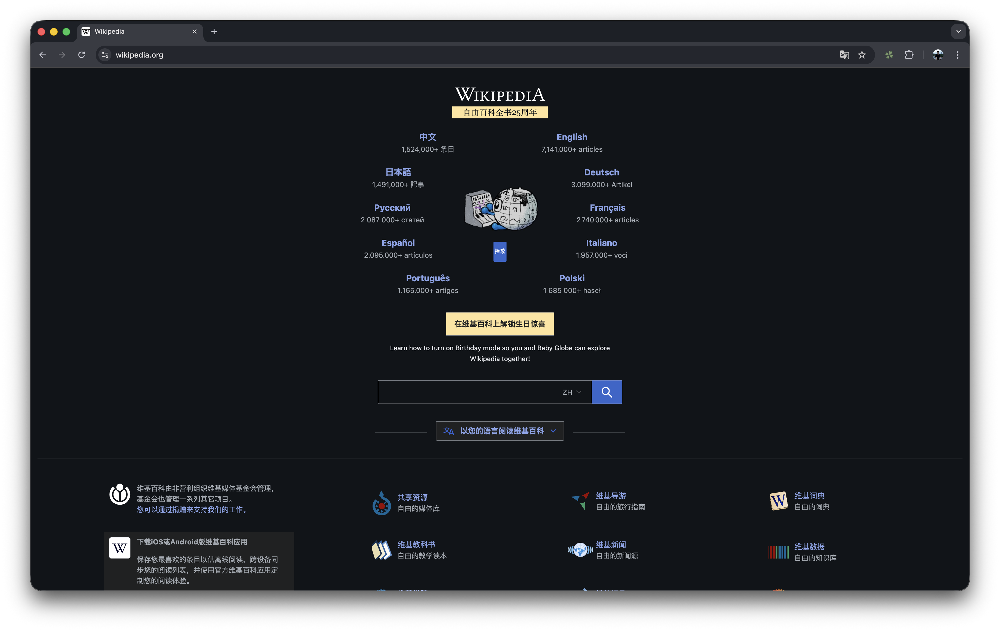
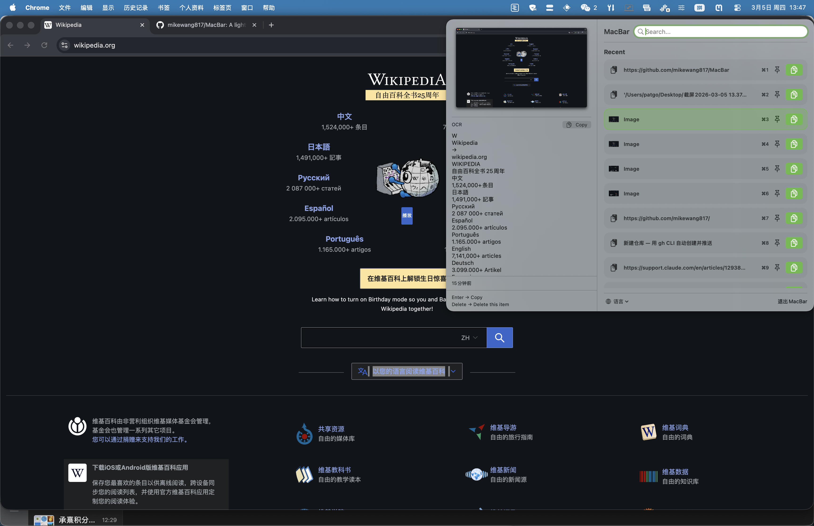

# MacBar

轻量级 macOS 菜单栏剪贴板管理器。无云端、无追踪、无第三方依赖——所有数据都留在你的 Mac 上。





## 功能特性

### 剪贴板历史
MacBar 静默监控你的剪贴板，保存所有复制过的内容——文本、图片和文件。

- **文本** — 完整保存内容，无大小限制
- **图片** — 原始 TIFF 数据存储，无大小限制
- **文件** — 捕获 Finder 中的文件复制操作，保存完整路径

无数量限制。固定常用条目，防止被清除。

### 即时搜索
在搜索栏输入关键词，实时过滤历史记录。

- 搜索文本内容
- 搜索图片的 OCR 识别文字
- 搜索文件名和路径

### 图片 OCR
选中图片条目时，MacBar 自动调用 Apple Vision 框架提取文字。识别结果显示在预览面板，同时加入搜索索引——无需下载任何模型。

### 文件支持
在 Finder 中正常复制文件，MacBar 自动捕获文件引用，支持重新粘贴或从预览面板直接在 Finder 中显示。

### 固定条目
固定常用条目，置顶显示，不会被自动清除。

### 164 种语言
随时从左下角菜单切换界面语言，选择跨会话保存。

---

## 使用方法

### 打开 MacBar
- **点击**菜单栏图标（⊟）
- **全局快捷键**：在任意应用中按 `⇧⌘M`

### 复制条目
| 操作 | 效果 |
|------|------|
| 点击行上的复制按钮 | 复制并移到顶部 |
| 按 `Enter` | 复制当前选中条目 |
| `⌘1` – `⌘9` | 复制第 1–9 条最近记录 |
| `⌘A` – `⌘Z` | 复制第 1–26 条固定条目 |

### 导航
| 按键 | 操作 |
|------|------|
| `↑` / `↓` | 上下移动选中项 |
| 直接输入 | 搜索过滤条目 |
| `Esc` | 清空搜索 |

### 管理条目
| 操作 | 方式 |
|------|------|
| 固定 / 取消固定 | 点击行上的图钉图标 |
| 删除条目 | 选中后按 `⌘Delete`（搜索框有内容时同样有效） |
| 在 Finder 中显示文件 | 选中文件条目 → 点击预览面板中的**在 Finder 中显示** |

### 预览面板
选中任意条目后，左侧打开预览面板：

- **文本条目** — 完整内容，支持文本选择
- **图片条目** — 完整图片预览 + OCR 文字，一键复制按钮
- **文件条目** — 完整路径，支持文本选择 + **在 Finder 中显示**按钮

悬停在文件行上可查看显示所有完整路径的提示。

---

## 安装

1. 从 [Releases](https://github.com/mikewang817/MacBar/releases) 下载 `MacBar-v1.0.0.zip`
2. 解压后将 `MacBar.app` 移动到 `/Applications` 文件夹
3. **首次启动** — 右键点击 `MacBar.app` → **打开** → **打开**（未公证应用，Gatekeeper 仅提示一次）

   或在终端执行以下命令，永久跳过提示：
   ```bash
   xattr -rd com.apple.quarantine /Applications/MacBar.app
   ```
4. MacBar 以 ⊟ 图标出现在菜单栏，无 Dock 图标

**系统要求：** macOS 14（Sonoma）及以上，Apple Silicon

---

## 从源码构建

MacBar 使用 Swift Package Manager，无需 Xcode 项目文件。

```bash
git clone https://github.com/mikewang817/MacBar.git
cd MacBar
swift build          # 编译
swift run MacBar     # 运行（Vision OCR 功能需要 app bundle）
open Package.swift   # 用 Xcode 打开（推荐）
```

> **注意：** 建议通过 Xcode 运行以获得完整功能。`swift run` 可用于基础测试，但 Vision OCR 需要 app bundle 环境。

**系统要求：** macOS 14+，Xcode 15+

---

## 隐私

- 永不发起网络请求
- 无分析统计或崩溃上报
- 所有数据通过 `UserDefaults` 本地存储在你的 Mac 上
- OCR 完全通过 Apple Vision 框架在设备上运行
- 随时可暂停剪贴板监控

---

## 许可证

MIT
